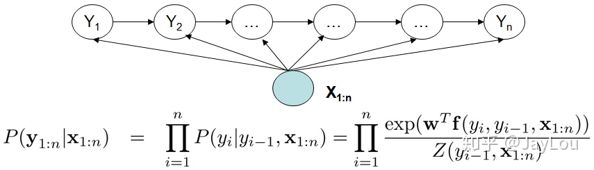
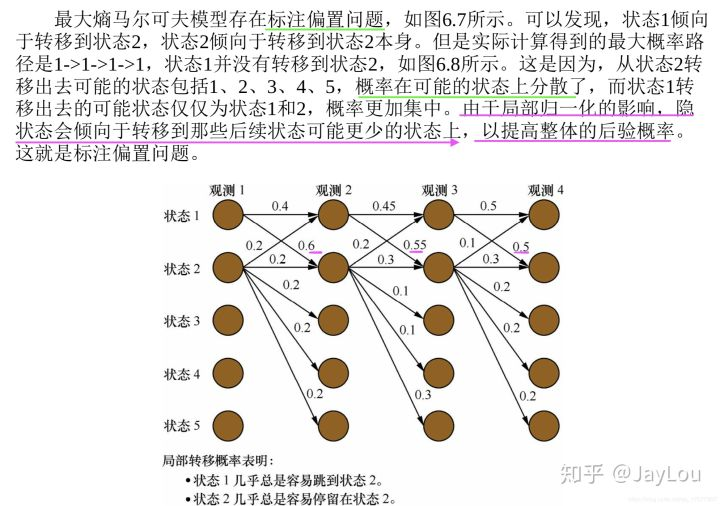

# 过拟合
## L1/L2 正则化
正则化是w权重的值偏小，趋势每层的输出值偏小。对于激活函数来说类似于把输出聚集在0附近， 而在0附近激活函数类似线性，这就降低了激活函数的非线性功能

原因：通过正则化，使神经元的输出偏小，类似于消除了部分神经元，使得网络变得简单。存在一个状态使得模型比较好的拟合输入数据。
## dropout 也是正则化
注意scale，作用：使神经元的期望和不使用dropout一致
## data augumentation
## early stop
同时优化两个问题
- 减小loss
- 防止过拟合

问题：提前结果会导致loss比较大
# Relu
优点包括：
- 解决了梯度消失、爆炸的问题
- 计算方便，计算速度快，求导方便
- 加速网络训练

缺点包括：
- 由于负数部分恒为0，会导致一些神经元无法激活
- 输出不是以0为中心
# softmax计算中的问题
$$
a_i = \frac{\exp(a_i)}{\sum_{j=0}^N{\exp(a_j)}}
$$
当$a_i$过大时，可能会导致$\exp(a_i)$溢出，使用时可以归一化计算
$$
\exp(a_i) = \frac{\exp(a_i)}{\exp(\max(a_j))}=\exp(a_i-\max(a_j)) \leq 1
$$
# 梯度消失与爆炸
第一个问题相对简单，由于反向传播过程中，前面网络权重的偏导数的计算是逐渐从后往前累乘的，如果使用sigmoid，tanh激活函数的话，由于导数小于一，因此累乘会逐渐变小，导致梯度消失，前面的网络层权重更新变慢；

如果权重w本身比较大，累乘会导致前面网络的参数偏导数变大，产生数值上溢。因为 sigmoid 导数最大为1/4，故只有当abs(w)>4时才可能出现梯度爆炸，因此最普遍发生的是梯度消失问题。

解决方法：
- 使用ReLU等激活函数，梯度只会为0或者1，每层的网络都可以得到相同的更新速度
- 采用LSTM进行梯度裁剪(clip), 如果梯度值大于某个阈值，我们就进行梯度裁剪，限制在一个范围内
- 使用正则化，这样会限制参数w的大小，从而防止梯度爆炸
- 设计网络层数更少的网络
- 进行模型训练batch normalization

## 激活函数
### sigmoid
$$
f_x = \frac{1}{1+e^{-x}}\\
f'_x = -\frac{e^{-x}}{(1+e^{-x})^2} \leq -\frac{1}{4}\\
f'_x = f_x (1-f_x)
$$
### tanh
$$
f_x = \frac{e^x-e^{-x}}{e^x+e^{-x}}\\
f'_x = \frac{2e^{2x}}{(e^{2x}+1)^2} \leq \frac{1}{2}\\
f'_x = \frac{1-f_x^2}{2}
$$
### softmax
$$
f_x = \cfrac{e^{x_i}}{\sum e^{x_j}}\\
f'_x = \cfrac{(e^{x_i} \sum e^{x_j}) - e^{2x_i}}{(\sum e^{x_j})^2}\\
f'_x = f_x (1-f_x)
$$

## 非平衡数据集的处理方法有哪些？
- 采用更好的评价指标，例如F1、AUC曲线等，而不是Recall、Precision
- 进行过采样，随机重复少类别的样本来增加它的数量；
- 进行欠采样，随机对多类别样本降采样
- 通过在已有数据上添加噪声来生成新的数据
- 修改损失函数，添加新的惩罚项，使得小样本的类别被判断错误的损失增大，迫使模型重视小样本的数据
- 使用组合/集成方法解决样本不均衡，在每次生成训练集时使用所有分类中的小样本量，同时从分类中的大样本量中随机抽取数据来与小样本量合并构成训练集，这样反复多次会得到很多训练集和训练模型。最后在应用时，使用组合方法（例如投票、加权投票等）产生分类预测结果；

对应几点：
- 上采样（过采样？）、子采样（欠采样？）
- 修改权重（类似focalloss）
- 组合、集成方法：bagging、boosting
- 多任务联合学习（扩展数据集？）
## CRF与HMM模型的区别？
- 大的不同点是linear-CRF模型是判别模型，而HMM是生成模型，即linear-CRF模型要优化求解的是条件概率P(y|x),则HMM要求解的是联合分布P(x,y)。
- 第二，linear-CRF是利用最大熵模型的思路去建立条件概率模型，对于观测序列并没有做马尔科夫假设。而HMM是在对观测序列做了马尔科夫假设的前提下建立联合分布的模型。

注：HMM假设：1. （一阶马尔科夫假设）当前隐含状态只和前一隐含状态有关，与其他状态以及观测无关。2.（观测独立性假设）观测状态只和当前隐含状态有关。

HMM、MEMM、CRF对比
1. HMM是有向图模型，是生成模型；HMM有两个假设：一阶马尔科夫假设和观测独立性假设；但对于序列标注问题不仅和单个词相关，而且和观察序列的长度，单词的上下文，等等相关。
2. MEMM（最大熵马尔科夫模型）是有向图模型，是判别模型；MEMM打破了HMM的观测独立性假设，MEMM考虑到相邻状态之间依赖关系，且考虑整个观察序列，因此MEMM的表达能力更强；但MEMM会带来标注偏置问题：由于局部归一化问题，MEMM倾向于选择拥有更少转移的状态。这就是标记偏置问题。

3. CRF模型解决了标注偏置问题，去除了HMM中两个不合理的假设，当然，模型相应得也变复杂了。

HMM、MEMM和CRF的优缺点比较：
1. 与HMM比较。CRF没有HMM那样严格的独立性假设条件，因而可以容纳任意的上下文信息。特征设计灵活（与ME一样）
2. 与MEMM比较。由于CRF计算全局最优输出节点的条件概率，它还克服了最大熵马尔可夫模型标记偏置（Label-bias）的缺点。
3. 与ME比较。CRF是在给定需要标记的观察序列的条件下，计算整个标记序列的联合概率分布，而不是在给定当前状态条件下，定义下一个状态的状态分布.

注：首先，CRF，HMM(隐马模型)，MEMM(最大熵隐马模型)都常用来做序列标注的建模，像分词、词性标注，以及命名实体标注

隐马模型一个最大的缺点就是由于其输出独立性假设，导致其不能考虑上下文的特征，限制了特征的选择

最大熵隐马模型则解决了隐马的问题，可以任意选择特征，但由于其在每一节点都要进行归一化，所以只能找到局部的最优值，同时也带来了标记偏见的问题，即凡是训练语料中未出现的情况全都忽略掉。

条件随机场则很好的解决了这一问题，他并不在每一个节点进行归一化，而是所有特征进行全局归一化，因此可以求得全局的最优值。

crf的损失函数是什么？lstm+crf怎么理解？

## SVM和LR
1. 对非线性表达上，逻辑回归只能通过人工的特征组合来实现，而SVM可以很容易引入非线性核函数来实现非线性表达，淡然也可以通过特征组合。
2. 逻辑回归产出的是概率值，而SVM只能产出是正类还是负类，不能产出概率。
3. 逻辑回归的损失函数是log loss，而SVM使用的是hinge loss。
4. SVM主要关注的是“支持向量”，也就是和分类最相关的少数点，即关注局部关键信息；而逻辑回归是在全局进行优化的。这导致SVM天然比逻辑回归有更好的泛化能力，防止过拟合。
5. 损失函数的优化方法不同，逻辑回归是使用梯度下降来求解对数似然函数的最优解；SVM使用SMO方法，来求解条件约束损失函数的对偶形式。
6. 处理的数据规模不同。LR一般用来处理大规模的学习问题。如十亿级别的样本，亿级别的特征。（SVM是二次规划问题，需要计算m阶矩阵）
7. svm 更多的属于非参数模型，而logistic regression 是参数模型，本质不同。其区别就可以参考参数模型和非参模型的区别。

其中， $g(x)=(1+e^{-z})^{-1}=\text{sigmoid}(z)$.

## 交叉熵与kl散度
$$
\begin{aligned}
    KL(p||q) &= -\int p(x)\ln(q(x)) {\rm d}x - \int p(x)\ln(p(x)) {\rm d}x \\
    &= CrossEntropy(p(x)) - \int p(x)\ln(p(x)){\rm d}x\\
    const &= -\int p(x)\ln(p(x)){\rm d}x\\
    L_\theta &= \prod p_x\\
    \log L_\theta &= \sum \log p_x
\end{aligned}
$$
优化交叉熵等同于优化相对熵，即KL散度, 最小化交叉熵等同于最大化对数似然函数。交叉熵描述的是和真实分布的差值，对数似然函数描述和真实分布相似程度，二者相反。