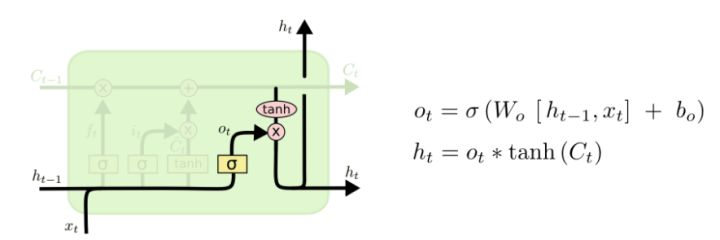
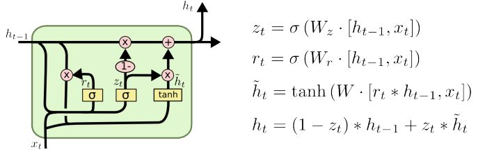

# RNN
GRU 参数更少，性能相似
## LSTM

正向传播
- forget gate: 
  - $f_t = \sigma(W_f \cdot [h_{t-1};x_t] + b_f)$
- input gate: 
  - $i_t=\sigma(W_i \cdot [h_{t-1};x_t]+b_i)$
  - $\hat{C_t}=\tanh(W_C \cdot [h_{t-1};x_t]+b_C)$
  - $C_t=f_t \cdot C_{t-1} + i_t \cdot \hat{C_t}$
- output gate:
  - $o_t = \sigma(W_o \cdot [h_{t-1};x_t] + b_o)$
  - $h_t = o_t \cdot \tanh(C_t)$
## GRU

无bias？

正向传播
- reset gate:
  - $r_t = \sigma(W_r \cdot [h_{t-1};x_t])$
- update gate:
  - $z_t = \sigma(W_z \cdot [h_{t-1};x_t])$
- update:
  - $\hat{h_t} = \tanh(W \cdot [r_t \cdot h_{t-1};x_t])$
  - $h_t = (1-z_t) \cdot h_{t-1} + z_t \cdot \hat{h_t}$