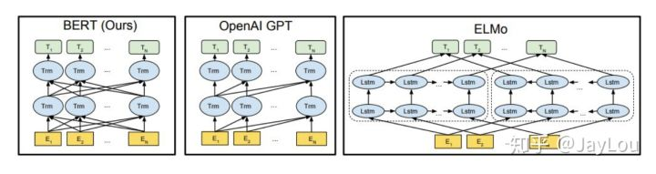

## 语言模型中，Bert为什么在masked language model中采用了80%、10%、10%的策略？
答：如果训练的时候100%都是Mask，那么在fine-tune的时候，所有的词时候已知的，不存在[Mask]，那么模型就只知道根据其他词的信息来预测当前词，而不会直接利用这个词本身的信息，会凭空损失一部分信息，对下游任务不利。

还有 10% random token 是因为如果都用原 token，模型在预训练时可能会偷懒，不去建模单词间的依赖关系，直接照抄当前词

[MASK] 是以一种显式的方式告诉模型『这个词我不告诉你，你自己从上下文里猜』，从而防止信息泄露。如果 [MASK] 以外的部分全部都用原 token，模型会学到『如果当前词是 [MASK]，就根据其他词的信息推断这个词；如果当前词是一个正常的单词，就直接抄输入』。这样一来，在 finetune 阶段，所有词都是正常单词，模型就照抄所有词，不提取单词间的依赖关系了。

以一定的概率填入 random token，就是让模型时刻堤防着，在任意 token 的位置都需要把当前 token 的信息和上下文推断出的信息相结合。这样一来，在 finetune 阶段的正常句子上，模型也会同时提取这两方面的信息，因为它不知道它所看到的『正常单词』到底有没有被动过手脚的。

    注：为了fine-tune阶段，使用了在mask的概率上使用原来词和替换为随机词，替换为mask三种概率操作，这样让模型去分辨当前词和上下文之间的关系。如果只有mask，那么模型可能会只依赖上下文，对fine-tune不利。加入随机词和原来词，让模型学会分辨当前词和上下文之间的关系。
## Bert现有的问题有哪些？

答：Bert模型过于庞大，参数太多，无论是feature-based approach还是fine-tune approach都很慢；

而且因为表示是上下文相关的，上线的应用需要实时处理，时间消耗太大；Bert给出来的中文模型中，是以字为基本单位的，很多需要词向量的应用无法直接使用；同时该模型无法识别很多生僻词，都是UNK；

Bert模型作为自回归模型，由于模型结构的问题，无法给出句子概率值

    注：自回归模型和生成模型之间的关系。（待补）

## 一些小问题
### 1. word2vec和tf-idf 相似度计算时的区别？
word2vec 1、稠密的 低维度的 2、表达出相似度； 3、表达能力强；4、泛化能力强；

注：
- tfidf计算相似度可能需要将两篇文档中的所有词都考虑，一一对应。导致维度很高
### 2. word2vec和NNLM对比有什么区别
- 其本质都可以看作是语言模型；
- 词向量只不过NNLM一个产物，word2vec虽然其本质也是语言模型，但是其专注于词向量本身，因此做了许多优化来提高计算效率：
- 与NNLM相比，词向量直接sum，不再拼接，并舍弃隐层；
- 考虑到sofmax归一化需要遍历整个词汇表，采用hierarchical softmax 和negative sampling进行优化，hierarchical softmax 实质上生成一颗带权路径最小的哈夫曼树，让高频词搜索路劲变小；negative sampling更为直接，实质上对每一个样本中每一个词都进行负例采样；
### 3. word2vec负采样有什么作用？
负采样这个点引入word2vec非常巧妙，两个作用，1.加速了模型计算，2.保证了模型训练的效果，

一个是模型每次只需要更新采样的词的权重，不用更新所有的权重，那样会很慢。第二，中心词其实只跟它周围的词有关系，位置离着很远的词没有关系，也没必要同时训练更新，作者这点非常聪明。
### 4. word2vec和fastText对比有什么区别？（word2vec vs fastText）
- 都可以无监督学习词向量， fastText训练词向量时会考虑subword；
- fastText还可以进行有监督学习进行文本分类，其主要特点：

    结构与CBOW类似，但学习目标是人工标注的分类结果；采用hierarchical softmax对输出的分类标签建立哈夫曼树，样本中标签多的类别被分配短的搜寻路径；引入N-gram，考虑词序特征；引入subword来处理长词，处理未登陆词问题；
### 5. glove和word2vec、 LSA对比有什么区别？（word2vec vs glove vs LSA）
glove vs LSA:     
- LSA（Latent Semantic Analysis）可以基于co-occurance matrix构建词向量，实质上是基于全局语料采用SVD进行矩阵分解，然而SVD计算复杂度高；
- glove可看作是对LSA一种优化的高效矩阵分解算法，采用Adagrad对最小平方损失进行优化；

word2vec vs LSA:
- 主题模型和词嵌入两类方法最大的不同在于模型本身。
- 主题模型是一种基于概率图模型的生成式模型。其似然函数可以写为若干条件概率连乘的形式，其中包含需要推测的隐含变量(即主题)
- 词嵌入模型一般表示为神经网络的形式，似然函数定义在网络的输出之上。需要学习网络的权重来得到单词的稠密向量表示。

word2vec vs glove:
- word2vec是局部语料库训练的，其特征提取是基于滑窗的；而glove的滑窗是为了构建co-occurance matrix，是基于全局语料的，可见glove需要事先统计共现概率；因此，word2vec可以进行在线学习，glove则需要统计固定语料信息。
- word2vec是无监督学习，同样由于不需要人工标注；glove通常被认为是无监督学习，但实际上glove还是有label的，即共现次数$\log (X_{ij})$。
- word2vec损失函数实质上是带权重的交叉熵，权重固定；glove的损失函数是最小平方损失函数，权重可以做映射变换。
- 总体来看，glove可以被看作是更换了目标函数和权重函数的全局word2vec。
### 6. elmo、GPT、bert三者之间有什么区别？（elmo vs GPT vs bert）

之前介绍词向量均是静态的词向量，无法解决一次多义等问题。下面介绍三种elmo、GPT、bert词向量，它们都是基于语言模型的动态词向量。下面从几个方面对这三者进行对比：
1. 特征提取器：elmo采用LSTM进行提取，GPT和bert则采用Transformer进行提取。很多任务表明Transformer特征提取能力强于LSTM，elmo采用1层静态向量+2层LSTM，多层提取能力有限，而GPT和bert中的Transformer可采用多层，并行计算能力强。
2. 单/双向语言模型：
- GPT采用单向语言模型，elmo和bert采用双向语言模型。但是elmo实际上是两个单向语言模型（方向相反）的拼接，这种融合特征的能力比bert一体化融合特征方式弱。
- GPT和bert都采用Transformer，Transformer是encoder-decoder结构，GPT的单向语言模型采用decoder部分，decoder的部分见到的都是不完整的句子；bert的双向语言模型则采用encoder部分，采用了完整句子。
### 7. LSTM和GRU的区别？  
- GRU和LSTM的性能在很多任务上不分伯仲。
- GRU 参数更少因此更容易收敛，但是数据集很大的情况下，LSTM表达性能更好。
- 从结构上来说，GRU只有两个门（update和reset），LSTM有三个门（forget，input，output），GRU直接将hidden state 传给下一个单元，而LSTM则用memory cell 把hidden state 包装起来。